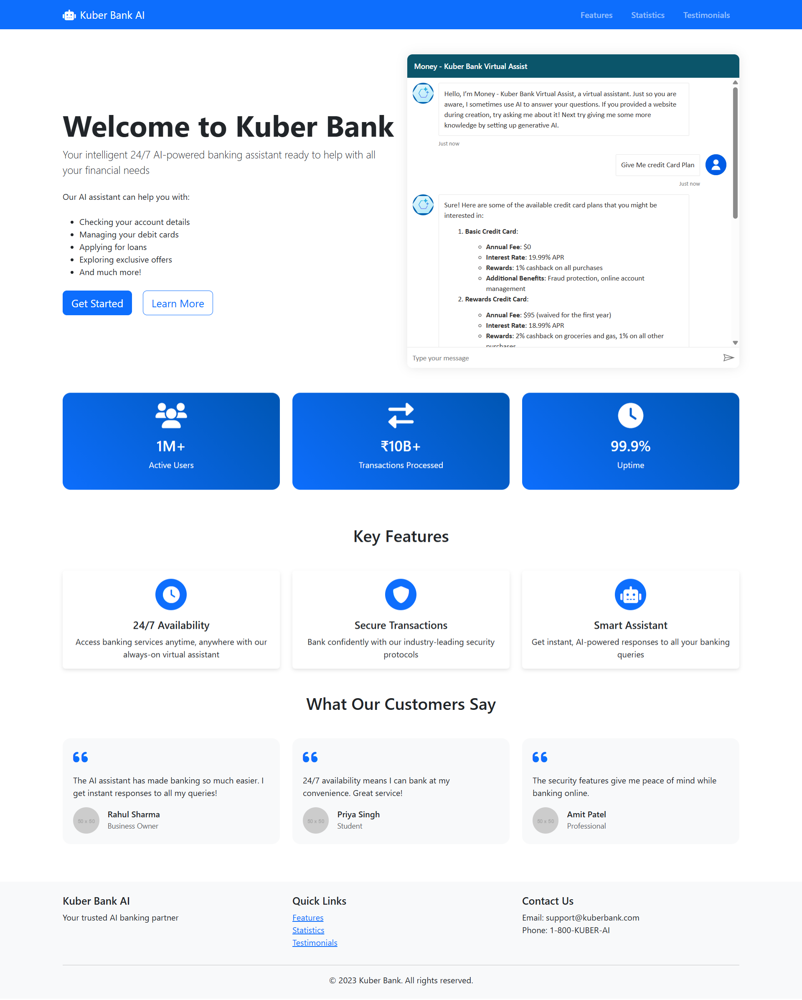

# Kuber-Bank-Conversation-AI

### Greeet
Here are five greeting messages for the Kuber Bank Chatbot:

1. **Welcome to Kuber Bank!** How can I assist you today with your banking needs? Whether it's account information, loan inquiries, or finding the nearest branch, I'm here to help!
2. **Hello and welcome to Kuber Bank’s virtual assistant!** I’m here to guide you through our services and answer any questions you may have. How may I assist you today?
3. **Greetings from Kuber Bank!** I’m your personal banking assistant, ready to provide you with quick and easy solutions. What can I help you with today?
4. **Welcome to Kuber Bank!** Let me know if you need assistance with your account, want to explore our financial services, or simply need some advice. I’m here for you!
5. **Hello!** You’ve reached Kuber Bank's virtual assistant. Need help with transactions, balance inquiries, or other services? Just ask, and I’ll do my best to assist you!

## Detailed Description of Kuber Bank Conversation AI Solutions

### Overview
Kuber Bank Conversation AI is an advanced AI-powered chatbot designed to assist customers with their banking needs. It leverages natural language processing (NLP) and machine learning (ML) technologies to provide accurate and efficient responses to customer queries. The AI is capable of handling a wide range of tasks, from answering basic questions to performing complex transactions.

### Architecture
The architecture of Kuber Bank Conversation AI consists of the following components:
- **Natural Language Processing (NLP) Engine**: This component processes and understands the customer's input, converting it into a format that the AI can work with.
- **Machine Learning (ML) Models**: These models are trained on vast amounts of banking data to provide accurate responses and predictions.
- **Backend Integration**: The AI is integrated with the bank's backend systems to access real-time data and perform transactions.
- **User Interface (UI)**: The chatbot interface is designed to be user-friendly and accessible across multiple platforms, including web and mobile.

### Technologies Used
- **Natural Language Processing (NLP)**: The AI uses NLP techniques to understand and process customer queries.
- **Machine Learning (ML)**: ML models are used to provide accurate responses and predictions.
- **Cloud Computing**: The AI is hosted on cloud platforms to ensure scalability and reliability.
- **APIs**: The AI uses APIs to integrate with the bank's backend systems and access real-time data.

### Key Features
- **24/7 Availability**: The AI is available round the clock to assist customers with their banking needs.
- **Multi-Platform Support**: The chatbot can be accessed via web, mobile, and other platforms.
- **Personalized Responses**: The AI provides personalized responses based on the customer's profile and transaction history.
- **Secure Transactions**: The AI ensures secure transactions by following industry-standard security protocols.

### Use Cases
- **Account Information**: Customers can inquire about their account balance, transaction history, and other account-related information.
- **Loan Inquiries**: The AI can provide information about different loan products, eligibility criteria, and application status.
- **Branch Locator**: Customers can find the nearest branch or ATM using the chatbot.
- **Transaction Assistance**: The AI can assist with fund transfers, bill payments, and other transactions.
- **Customer Support**: The chatbot can handle common customer support queries and escalate complex issues to human agents if needed.

### Scenarios
1. **Account Balance Inquiry**: A customer asks the chatbot for their account balance. The AI processes the request, retrieves the information from the backend system, and provides the balance to the customer.
2. **Loan Application Status**: A customer inquires about the status of their loan application. The AI checks the application status in the backend system and informs the customer.
3. **Fund Transfer**: A customer wants to transfer funds to another account. The AI guides the customer through the process, verifies the details, and completes the transaction securely.
4. **Branch Locator**: A customer asks for the nearest branch. The AI uses location data to find the nearest branch and provides the address and contact details to the customer.
5. **Customer Support**: A customer has a query about a recent transaction. The AI provides relevant information and, if necessary, escalates the issue to a human agent for further assistance.
