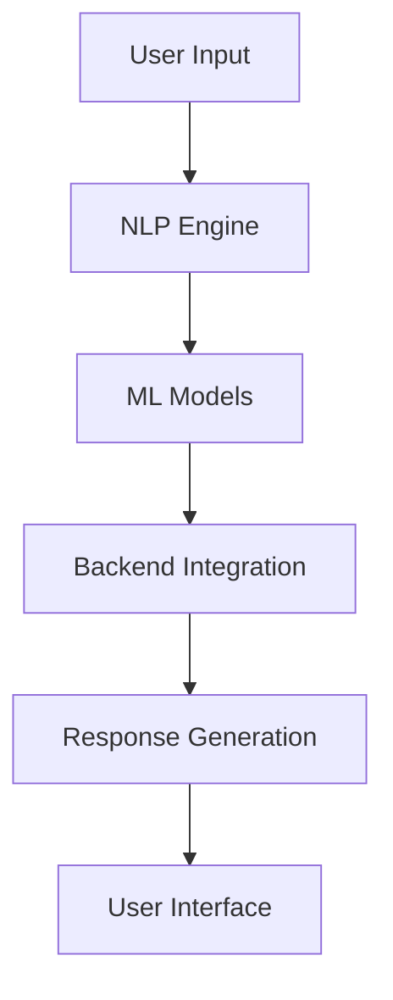
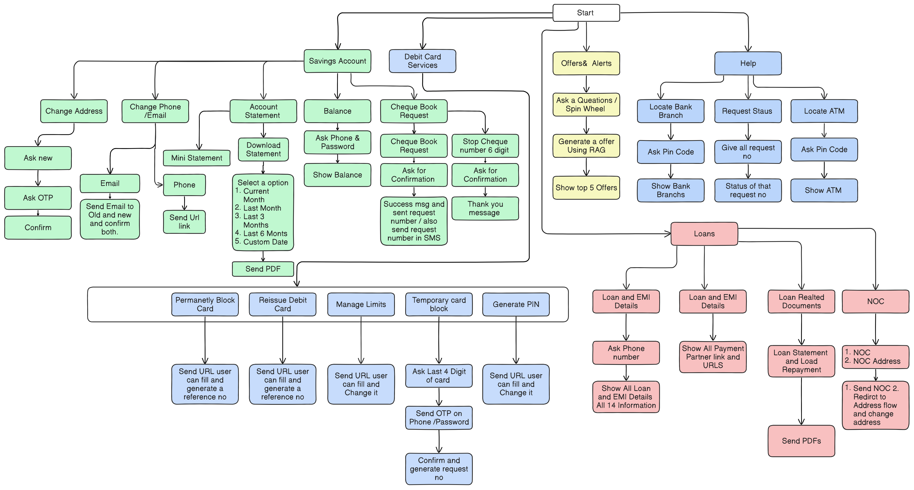

# Kuber Bank Conversation AI 🏦

> An intelligent banking assistant powered by advanced NLP and ML technologies

[](https://youtu.be/nXhfo_op2iU)
[](https://github.com/YourUsername/Kuber-Bank-Conversation-AI)

## 📋 Overview

Kuber Bank Conversation AI is a sophisticated chatbot designed to revolutionize banking customer service. Powered by cutting-edge Natural Language Processing (NLP) and Machine Learning (ML) technologies, it provides seamless assistance for various banking operations 24/7.


## 🌟 Key Features

- **24/7 Availability** - Round-the-clock customer assistance
- **Multi-Platform Support** - Seamless experience across web and mobile
- **Personalized Interactions** - Custom responses based on user profiles
- **Secure Transactions** - Industry-standard security protocols
- **Smart Automation** - Efficient handling of routine banking tasks

## 🏗️ Architecture

Our robust architecture ensures reliable and efficient service delivery:



### Core Components

| Component | Description |
|-----------|-------------|
| NLP Engine | Processes and understands customer queries |
| ML Models | Provides accurate predictions and responses |
| Backend Integration | Connects with bank systems for real-time data |
| User Interface | User-friendly interface across platforms |

## 💼 Use Cases

### 1. Account Services
- Balance inquiries
- Transaction history
- Statement requests

### 2. Loan Services
- Loan eligibility checks
- Application status tracking
- EMI calculations

### 3. Support Services
- Branch/ATM locator
- General banking queries
- Issue resolution

## 🤖 Sample Interactions

### Welcome Messages
1. **Professional Welcome**
   > "Welcome to Kuber Bank! How can I assist you today with your banking needs?"

2. **Friendly Greeting**
   > "Hello and welcome to Kuber Bank's virtual assistant! I'm here to guide you through our services."

3. **Service-Focused**
   > "Greetings from Kuber Bank! Ready to provide quick and easy solutions for all your banking needs."

## 🛠️ Technologies Used

- **Frontend**: React.js, Material-UI
- **Backend**: Python, TensorFlow
- **Cloud**: AWS/Azure
- **Security**: OAuth 2.0, JWT
- **APIs**: RESTful Services

## 🔄 Business Flow



## 📊 Implementation Scenarios

### Account Balance Query
```sequence
User->AI: Balance inquiry
AI->Backend: Fetch data
Backend->AI: Return balance
AI->User: Display balance
```

### Loan Application Status
```sequence
User->AI: Status check
AI->Backend: Application lookup
Backend->AI: Status update
AI->User: Status display
```


## 📺 Demo

Watch our demonstration video to see Kuber Bank Conversation AI in action:

[](https://youtu.be/nXhfo_op2iU)


---

<p align="center">Made with ❤️ by the Kuber Bank Team</p>
